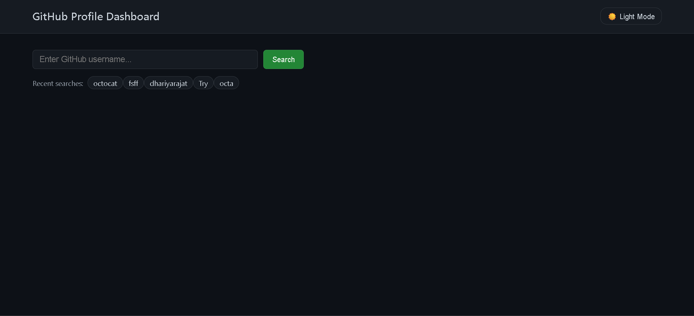
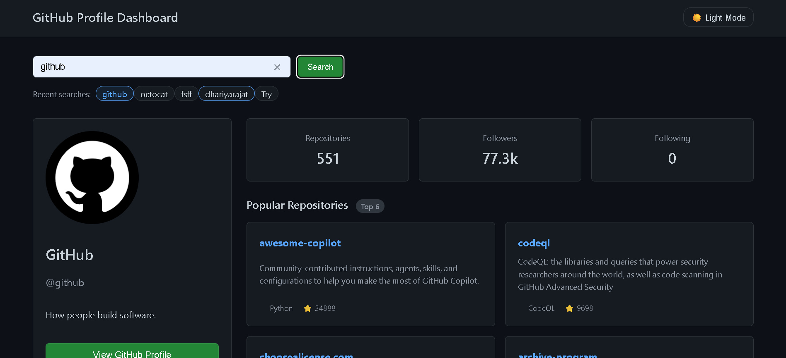
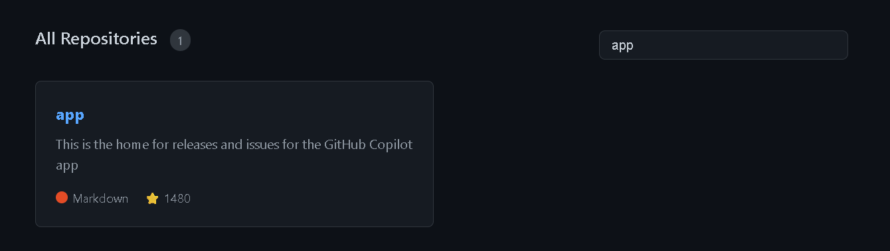

# GitHub Profile Dashboard

A responsive GitHub Profile Dashboard built using HTML, CSS, and JavaScript. This project fetches real-time GitHub user data using the GitHub REST API and displays profile information, statistics, and repositories in a clean GitHub-inspired UI.

## 🚀 Features

* Search any GitHub user
* Fetch live data from GitHub REST API
* Display profile details

  * Avatar
  * Name
  * Username
  * Bio
  * Location
* Display GitHub statistics

  * Public Repositories
  * Followers
  * Following
* View user repositories
* Real-time repository search/filter
* Recent searches stored using LocalStorage
* Theme persistence using LocalStorage
* Responsive design for mobile, tablet, and desktop
* Loading and error states
* GitHub-style modern UI

## 🛠️ Technologies Used

* HTML5
* CSS3
* JavaScript (ES6+)
* GitHub REST API
* LocalStorage

## 📸 Screenshots

### Home Page

### Profile Dashboard

### Repository Search & Filter

## 📚 Concepts Implemented

This project helped me practice:

* DOM Manipulation
* Event Handling
* Form Validation
* Fetch API
* Async / Await
* Promise.all()
* Array Destructuring
* LocalStorage
* Error Handling (try/catch)
* Responsive Web Design

## 🔍 How It Works

1. User enters a GitHub username.
2. The application sends requests to the GitHub API.
3. Profile and repository data are fetched in parallel using Promise.all().
4. The UI is updated dynamically using JavaScript.
5. Recent searches are stored locally using LocalStorage.
6. Users can search and filter repositories in real time.

## ⚡ API Endpoints Used

User Profile:

https://api.github.com/users/dhariyarajat

User Repositories:

https://api.github.com/users/{username}/repos

## 🎯 Future Improvements

* Repository Sorting
* Pagination
* Language Statistics
* Repository Charts
* Favorite Profiles
* Export Profile Data

## 🌐 Live Demo

https://github-dashboard-viewer.netlify.app/

## 👨‍💻 Author

Rajat

Built as a frontend project to practice API integration, JavaScript fundamentals, and modern web development concepts.
